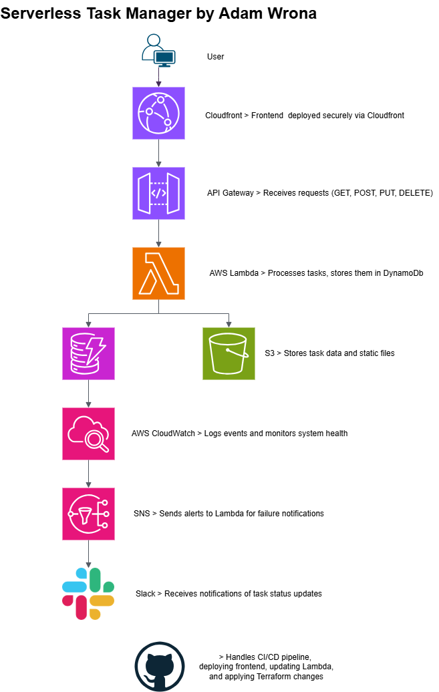

# ⚙️ Serverless Task Manager – Production-Ready Template for DevOps & Platform Teams

## 🧰 Tech Stack & Tooling

### 💻 Core


### ⚙️ Tooling & Automation


### 📈 Status & Metrics


A lightweight, production-ready task manager built using 100% AWS managed services.  
Designed for scalability, automation, and zero server maintenance.

🌐 **LIVE DEMO:**  
👉 https://d22fapw93bv9rh.cloudfront.net/

🔒 Deployed securely via AWS CloudFront with OAI (Origin Access Identity)

---

## 🏗 Architecture Overview



| Layer        | Technology                                                                             |
|--------------|----------------------------------------------------------------------------------------|
| **Frontend** | Frontend | HTML/CSS/JS (vanilla), hosted on Amazon S3 via CloudFront (HTTPS)           |
| **API**      | AWS Lambda (Python), exposed via API Gateway                                           |
| **Database** | Amazon DynamoDB                                                                        |
| **CI/CD**    | GitHub Actions + Terraform                                                             |
| **Security** | IAM roles, CORS with full HTTP method support (GET, POST, PUT, DELETE, OPTIONS), HTTPS |


---

## 💻 Developer Experience & CI/CD

This app is designed as a real-world starter template for cloud-native DevOps teams:

- **Zero setup** – `terraform apply` spins up everything  
- **Git-based CI/CD** – just push to `main` to deploy  
- **Fast local dev** – frontend served locally, API runs on AWS  
- **Logs in CloudWatch**, monitoring-ready, minimal ops overhead  

Use it to prototype tools, train engineers, or bootstrap internal apps.

---

## 🔑 Key Features

✅ 100% serverless – no EC2, no containers  

✅ Infrastructure as Code (Terraform)  

✅ End-to-end CI/CD with GitHub Actions  

✅ Secure by default (IAM, HTTPS, env vars)  

✅ Logging via CloudWatch  

✅ Slack alerting via SNS → Lambda → Webhook (done)

✅ CORS configured properly for all methods (including PUT) – production-ready frontend integration

---

## 🛠 Deployment Guide

### 1️⃣ Clone & Configure

```bash
git clone https://github.com/cloudcr0w/serverless-project.git
cd serverless-project
```

### 2️⃣ Provision AWS Infrastructure

```bash

cd terraform
terraform init
terraform apply -auto-approve
```

### 3️⃣ Deploy Frontend

```bash
cd frontend
aws s3 sync . s3://adamwrona-serverless-frontend --delete

# Then access it via: https://d22fapw93bv9rh.cloudfront.net/

```

### 4️⃣ Verify API Health

```bash
curl https://g0o9oadr06.execute-api.us-east-1.amazonaws.com/dev/tasks/
```

🔁 Update Task Status
You can update a task's status to "done" or "pending" using the following PUT request:

```bash

curl -X PUT "https://g0o9oadr06.execute-api.us-east-1.amazonaws.com/dev/tasks/<TASK_ID>" \
  -H "Content-Type: application/json" \
  -d '{"status": "done"}'0
```
✅ Accepted status values: pending, done
❌ Invalid values will return a 400 error.

Example response:

json

```bash
{
  "message": "Task 1234 updated",
  "status": "done"
}
```

### 🚀 How to Run Locally

```bash
cd terraform
pytest tests/test_lambda_function.py
./build.sh
terraform plan
```

### 🐳 Run locally with Docker

```bash
docker build -t task-manager-api .
docker run -p 5000:5000 task-manager-api
```

Then open http://localhost:5000/tasks


### 🔁 CI/CD Workflow

✅ Triggered on every push to main

✅ Terraform plans + applies infra changes

✅ AWS Lambda updated from source

✅ Frontend deployed to S3 (accessed via CloudFront)

✅ Logs viewable in GitHub Actions & CloudWatch

## 🛠️ Development Notes

- Run tests locally using `pytest` from `terraform/tests`
- Use `build.sh` to create and upload Lambda ZIP manually
- All infrastructure is managed via Terraform, including alerting

## ❓ FAQ

### Can I run this locally?
Yes! Use `pytest` to run tests and `build.sh` to package your Lambda.

### What happens if a task title is "FAIL"?
It triggers a simulated crash to test the alerting pipeline via CloudWatch → SNS → Lambda → Slack.


### 👨‍💻 About the Author
Created by Adam Wrona as part of my DevOps & Cloud Engineering journey 🚀
I'm open to feedback, improvements and contributions — feel free to fork or reach out!

### 💡 Like this project?

⭐ Star it on GitHub

🍴 Fork it

🧠 Share your ideas in Issues/Discussions


>> “Sometimes the bug isn't in the code... it's in your expectations.”
>> Deep Wisdom

>> „Czasem błąd nie leży w kodzie… tylko w twoich oczekiwaniach.”
>> — Głęboka mądrość

>> XD
