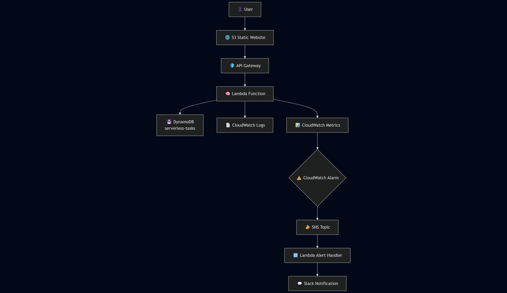

# ⚙️ Serverless Task Manager – Production-Ready Template for DevOps & Platform Teams

A lightweight, production-ready task manager built using 100% AWS managed services.  
Designed for scalability, automation, and zero server maintenance.

🌐 **LIVE DEMO:**  
👉 https://adamwrona-serverless-frontend.s3.amazonaws.com/index.html

---

## 🏗 Architecture Overview



| Layer        | Technology                                   |
|--------------|----------------------------------------------|
| **Frontend** | HTML/CSS/JS (vanilla), hosted on Amazon S3   |
| **API**      | AWS Lambda (Python), exposed via API Gateway |
| **Database** | Amazon DynamoDB                              |
| **CI/CD**    | GitHub Actions + Terraform                   |
| **Security** | IAM roles, CORS handling, HTTPS, encryption  |

---

## 💻 Developer Experience & CI/CD

This app is designed as a real-world starter template for cloud-native DevOps teams:

- **Zero setup** – `terraform apply` spins up everything  
- **Git-based CI/CD** – just push to `main` to deploy  
- **Fast local dev** – frontend served locally, API runs on AWS  
- **Logs in CloudWatch**, monitoring-ready, minimal ops overhead  

Use it to prototype tools, train engineers, or bootstrap internal apps.

---

## 🔑 Key Features

✅ 100% serverless – no EC2, no containers  
✅ Infrastructure as Code (Terraform)  
✅ End-to-end CI/CD with GitHub Actions  
✅ Secure by default (IAM, HTTPS, env vars)  
✅ Logging via CloudWatch  
✅ ✅ Slack alerting via SNS → Lambda → Webhook (done)

---

## 🛠 Deployment Guide

### 1️⃣ Clone & Configure

```bash
git clone https://github.com/cloudcr0w/serverless-project.git
cd serverless-project
```

### 2️⃣ Provision AWS Infrastructure

```bash

cd terraform
terraform init
terraform apply -auto-approve
```

### 3️⃣ Deploy Frontend

```bash
aws s3 sync . s3://adamwrona-serverless-frontend --delete
```

### 4️⃣ Verify API Health

```bash
curl https://<your-api-id>.execute-api.us-east-1.amazonaws.com/dev/tasks
```

### 🔁 CI/CD Workflow

✅ Triggered on every push to main

✅ Terraform plans + applies infra changes

✅ AWS Lambda updated from source

✅ Frontend deployed to S3

✅ Logs viewable in GitHub Actions & CloudWatch


### 👨‍💻 About the Author
Created by Adam Wrona as part of his DevOps & Cloud Engineering journey 🚀
I'm open to feedback, improvements and contributions — feel free to fork or reach out!

### 💡 Like this project?

⭐ Star it on GitHub

🍴 Fork it

🧠 Share your ideas in Issues/Discussions


>> “Sometimes the bug isn't in the code... it's in your expectations.”
>> Deep Wisdom

>> „Czasem błąd nie leży w kodzie… tylko w twoich oczekiwaniach.”
>> — Głęboka mądrość

>> XD